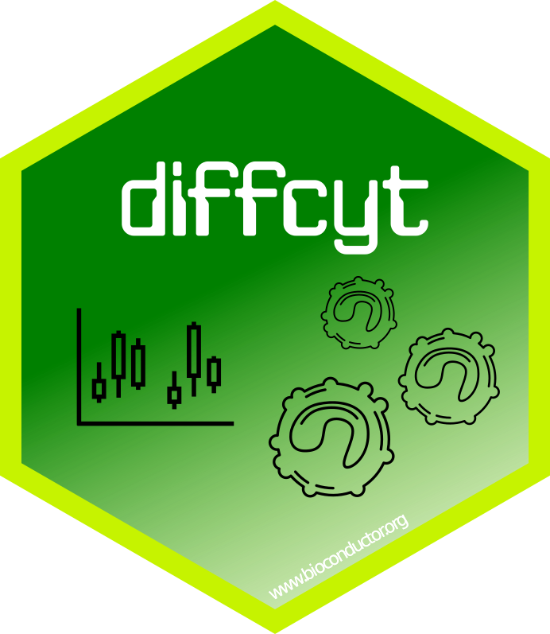

# diffcyt

[](https://github.com/lmweber/diffcyt/actions)


## Summary

`diffcyt`: R package for differential discovery in high-dimensional cytometry via high-resolution clustering

The `diffcyt` package implements statistical methods for differential discovery analyses in high-dimensional cytometry data (including flow cytometry, mass cytometry or CyTOF, and oligonucleotide-tagged cytometry), based on a combination of high-resolution clustering and empirical Bayes moderated tests adapted from transcriptomics.

<p>  </p>


## Details

For details on the statistical methodology and comparisons with existing approaches, see our paper introducing the `diffcyt` framework:

- [Weber et al. (2019), *diffcyt: Differential discovery in high-dimensional cytometry via high-resolution clustering*, Communications Biology, 2, 183](https://www.nature.com/articles/s42003-019-0415-5)


## Tutorial and examples

For a tutorial and examples of usage, see the Bioconductor [package vignette](http://bioconductor.org/packages/release/bioc/vignettes/diffcyt/inst/doc/diffcyt_workflow.html) (link also available via the main Bioconductor page for the [diffcyt package](http://bioconductor.org/packages/diffcyt)).


## Availability and installation

The `diffcyt` package is freely available from [Bioconductor](http://bioconductor.org/packages/diffcyt). The stable release version can be installed using the Bioconductor installer as follows. Note that installation requires R version 3.4.0 or later.

```{r}
# Install Bioconductor installer from CRAN
install.packages("BiocManager")

# Install 'diffcyt' package from Bioconductor
BiocManager::install("diffcyt")
```


To run the examples in the package vignette and generate additional visualizations, the `HDCytoData` and `CATALYST` packages from Bioconductor are also required.

```{r}
BiocManager::install("HDCytoData")
BiocManager::install("CATALYST")
```


## Development version

If required, the development version of the `diffcyt` package can be installed through the `devel` version of Bioconductor or from GitHub. The development version may include additional updates that have not yet been included in the release version. Note that we recommend using the release version in most cases, since this has been more thoroughly tested.

To set up the `devel` version of Bioconductor, see the Bioconductor help pages. To install the development version of the `diffcyt` package directly from GitHub, use the `devtools` package as follows. When installing from GitHub, dependency packages will also need to be installed separately from CRAN and Bioconductor.

```{r}
# Install 'devtools' package from CRAN
install.packages("devtools")

# Install development version of 'diffcyt' package from GitHub
library(devtools)
install_github("lmweber/diffcyt")
```

